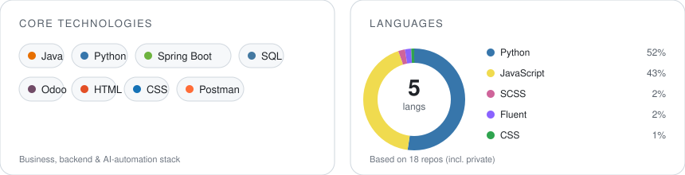

I build backend systems, Odoo ERP integrations, and AI/LLM automation — from business requirements to working software.

## Technical Skills

## Featured Projects

- [Virtual Office — AI-Assistant](https://github.com/Tyn-Trin/Visual-Office-Ai-Assistant)
- [AI Agent — Business Intelligence](https://github.com/Tyn-Trin/AI-Agent-transforms-it-into-Business-Intelligence-visualizations-)
- [Full Portfolio](https://github.com/Tyn-Trin/Trin-Rattansiri-Portfolio)

## Stats

## Contact

- Email: [tyntrin@gmail.com](mailto:tyntrin@gmail.com)
- Tel: 095-842-5523
